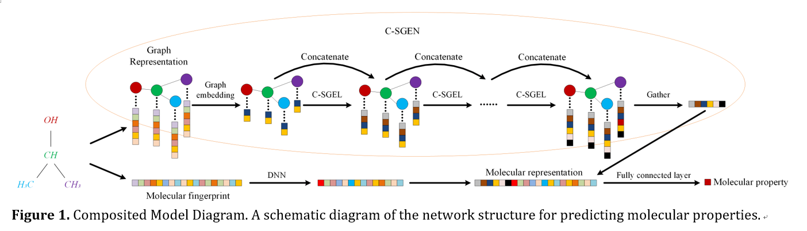

# C-SGEN
A PyTorch implementation of "Molecule Property Prediction based on Spatial Graph Embedding"
<p align="center">
  
</p>
<p align="justify">


### Requirements
The codebase is implemented in Python 3.6.7. package versions used for development are just below.
```
Theano            1.0.3
numpy             1.16.4
scipy             1.3.0
torch             1.1.0
timeit            1.1.0
sklearn           0.0
deepchem          2.1.1
torch-scatter     1.2.0
torch-sparse      0.4.0
torch-cluster     1.4.2
torch-geometric   1.2.1
torch-spline-conv 1.1.0
torchvision       0.3.0
rdkit             2019.03.3.0
ChemoPy           1.0.0
pickle            0.7.5
```


### Datasets
Feature.npy, Normed_adj.npy, fingerprint_stand.npy and Interactions.npy are molecular features, adjacency matrices, molecular fingerprints and corresponding target values in the data, respectively.Input for C-SGEN Model

full_feature, edge and Interactions.npy are molecular features, adjacency matrices and corresponding target values of pytorch_geometric specific data format in the data, respectively.


#### Model Hyper-Parameters
```
  --epochs                      INT     Number of epochs.                              Default is 33.
  --batch-size                  INT     Number fo molecules per batch.                 Default is 8.
  --C-SGEL-layers               INT     Number of C-SGELs.                             Default is 2.
  --ch_num                      INT     Number of neurons in Graph embedding layer.    Default is 16.
  --k                           INT     Number of filters in conv1d.                   Default is 4.
  --lr_decay                    FLOAT   Weight decay / 10 epochs.                      Defatuls is 0.5.
  --learning-rate               FLOAT   Adam learning rate.                            Default is 5e-4.
```


### Examples

The following commands learn a model and save the predictions. Training C-SGEN model on the default dataset,the data is ready to be saved in a folder. You can execute the above model directly.
```
python C-SGEN_trian.py
```

Training a PyG model directly.
```
python pyg_trian.py
```

Load data from DeepChem.
```
python load_FreeSolv.py
```
